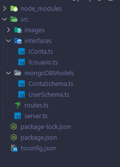

# DigitalRepublic2

<section>
  <h2>Contextualização</h2>
    
 Resolução do desafio proposto pela empresa Digital Republic em desenvolver um projeto Back-End. 

</section>

<section>
  <h2>Tecnologias utilizadas</h2>
    <ul>
      <li>NodeJs</li>
      <li>TypeScript</li>
      <li>MongoDb</li>
    </ul>
    
 A proposta do desafio não especificava um banco de dados, porém como já possuo conhecimento com MongoDB preferi optar por ele. 

    <h2>Bibliotecas utilizadas</h2>
    <ul>
      <li>Express (Criação das rotas)</li>
      <li>uuidv4 (Criação dos Id's)</li>
      <li>Bcrypt (Criação de senhas com hash)</li>
      <li>Mongoose (Manipulação de querys , modelos , schemas, etc, do MongoDB)</li>
    </ul>
    
 Foi utilizado o Visual Studio Code para o desenvolvimento de todo o código. 

    
 Foram feitos dois projetos utilizando das mesmas bibliotecas , vou separar cada um e explicar o porque de dois projetos diferente. 

</section>

<section>
  <h2> Segundo Projeto (Diferente) </h2>
  <h3> Organização das pastas </h3>
  
  
 Como podemos ver na imagem acima , possuímos a pasta src e dentro dela temos 2 pastas importantes, a "interfaces" e a "mongoDBModels", e também possuímos os arquivos routes.ts e server.ts.

  
  <h2> Pasta Interfaces </h2>
  <section>
    
 Dentro da pasta interfaces temos 2 arquivos , o IUsuario que seria a interface para a classe Usuario e o IConta que seria a interface para a classe Conta, dentro delas temos apenas a criação do contrato de cada classe com seus métodos e atributos como mostrado nas imagens abaixo

    
    
  </section>
  
  <h2> Pasta mongoDBModels </h2>
  <section>
    
 Dentro da pasta mongoDbModels nós possímos dois arquivos contendo os Schemas do Usuário e da Conta juntamente com a exportação de seus modelos, também é dentro destes Schemas que são feitos os contratos com as interfaces, assim sendo obrigarótio a criação dos atributos e métodos presentes nas interfaces.

    
 Na criação dos atributos do Schema nós possuímos algumas keywords que são: 

    <ul>
      <li> required - dado obrigatório ao construir o objeto </li>
      <li> type - tipo do dado (number, string, etc) </li>
    </ul>
    
 Onde se encontra a keyword methos, é onde ficam os métodos que poderão ser utilizados ao criar um objeto deste modelo.

    
 Imagens abaixo.

    
    
    
 No modelo da Conta nós possuímos os métodos: 

    <ul>
      <li> abrirConta - Cria uma nova conta bancária.</li>
      <li> depositar - Deposita um valor passado na conta bancária.</li>
      <li> transferir - Faz uma trasferência bancária.</li>
      <li> transferenciaRecebida - Notifica a conta que recebeu uma transferência.</li>
    </ul>
    
 No modelo do Usuário nós possuímos o método: 

    <ul>
      <li> createUsuario - Cria um novo usuário.</li>
    </ul>
  </section>
  
  <h2> Arquivo routes.ts </h2>
  <section>
    
 No arquivo routes.ts nós possuímos os endpoits do projeto, e eles são: 

    
 Métodos Get 

    <ul> 
      <li> getUser </li>
      <li> getConta </li>
      <li> getSaldo </li>
    </ul>
    
 Métodos Post 

    <ul> 
      <li> criarUsuario </li>
      <li> criarConta </li>
    </ul>
    
 Métodos Put 

    <ul> 
      <li> depositar </li>
      <li> transferencia </li>
    </ul>
  </section>
  
  <h2> Arquivo server.ts </h2>
  <section> 
    
 Por fim nós temos o arquivo server.ts onde fica a configuração e inicialização da API

  </section>
  
  <h2> Execução do projeto </h2>
    
 Ao baixar ou clonar o repositório basta utilizar npm i para instalar as dependências e rodar com npm run start, assim o projeto já te informando no próprio terminal que a porta foi aberta.
      OBS: Ao rodar o código caso sua porta 3000 esteja ocupada é só alterar este valor para qualquer outro.
  

</section>
